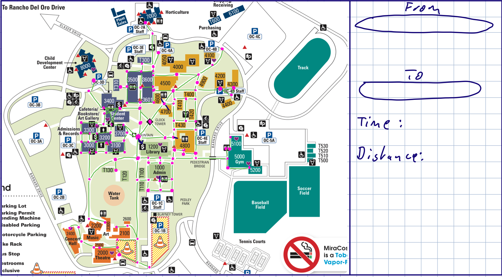
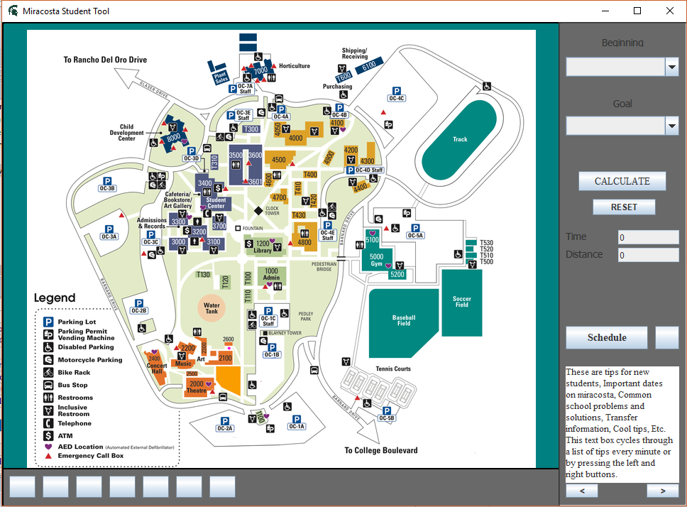
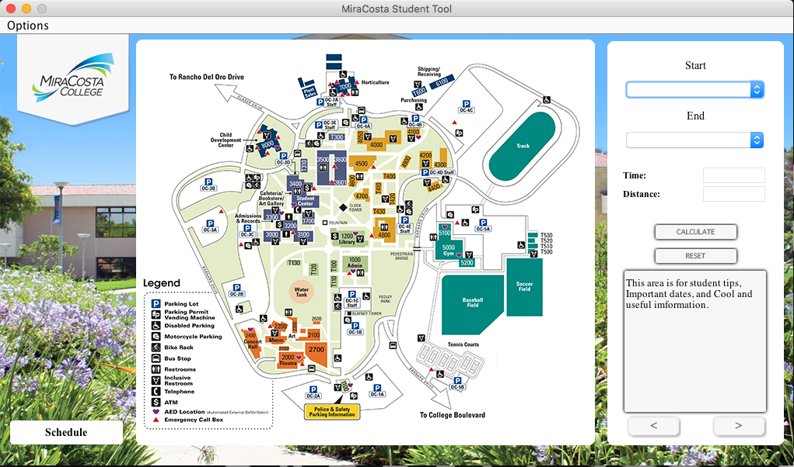
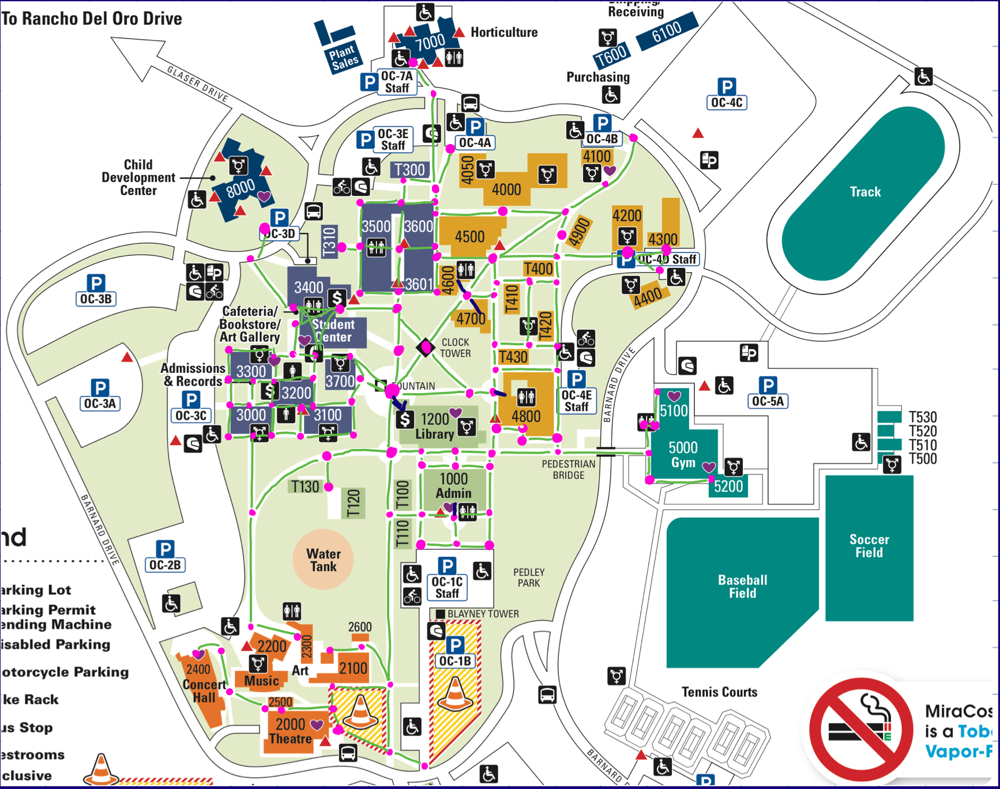
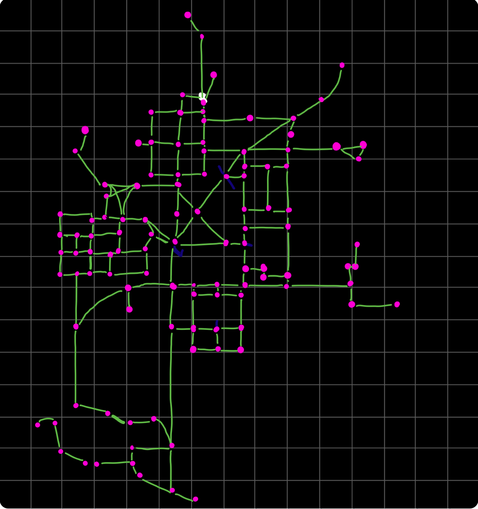
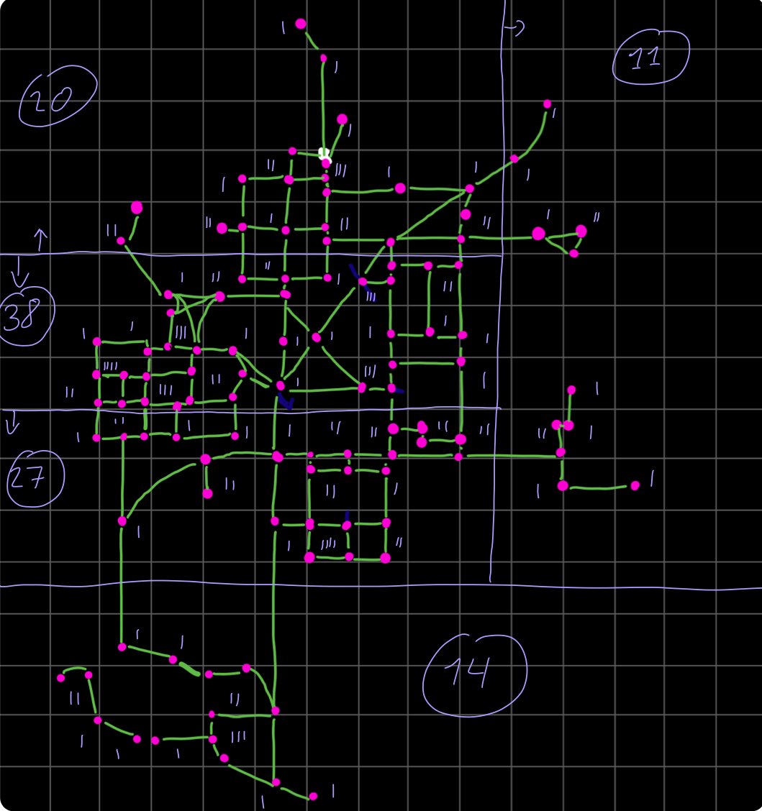
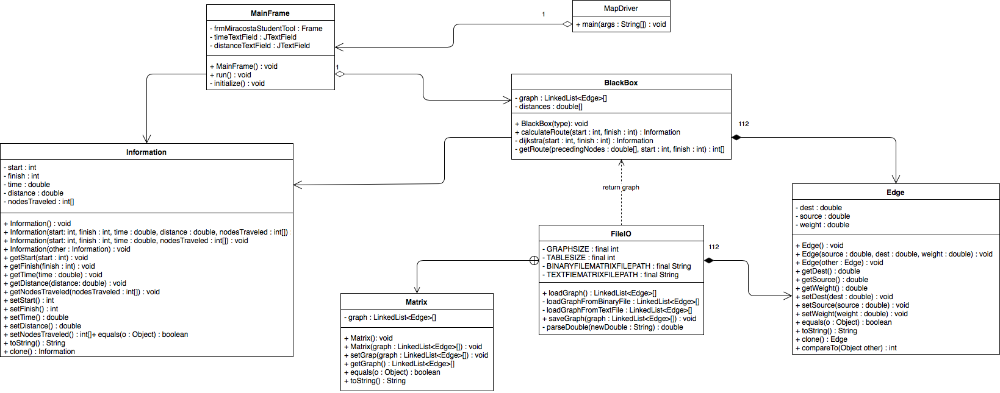
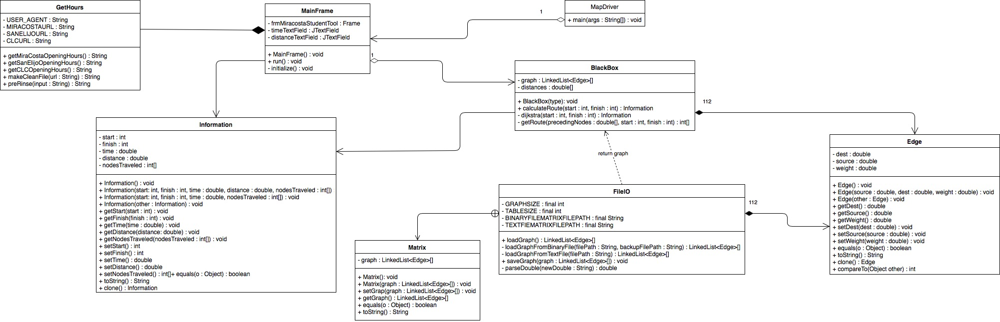
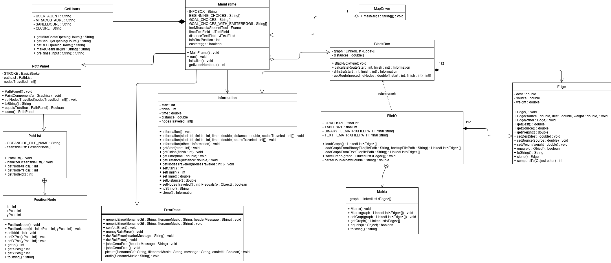

# CS113-FGP-Graph
## Final Group Project for CS113 - Graph

Complete the `Graph` class, either as an adjacency list or adjacency matrix, per the ADT proposal in the lecture slides along with an advanced algorithm (Dijkstra's, Prim's, DFS, BFS, or some other one we haven't covered [clear with instructor first]).  Use the data structure in a core/useful way for your groups idea. Ideally (but not required), you should include a view frontend to showcase your project.

**Use Scrum (Agile) development to build your group project over 3 weeks:**
- Sprint 0 = planning sprint
	- End of sprint should have: project proposal/description, decide graph algorithm, initial UML + sequence diagram
- Sprint 1 = first half of development
- Sprint 2 = second half of development
	- End of sprint should have: project completed+documented, screenshots, updated UML+sequence diagrams
- *See past group projects for general sprint requirements (i.e., unit tests for each sprint, updated documentation, etc.)*

**You will be graded on the following:**
- Complete/updated UML Class and relationship diagram
- Complete/updated Sequence diagram for driver (main part of program that creates objects, does user input, etc.)
- JUnit tests for all model classes + data structure (Graph)
	- Note: view classes need not have JUnit tests
- All code documented (author boxes, algorithm for driver, methods have description/precondition/postcondition, class invariants)
- No crashes/compile issues
**- Every group member writes significant amount of code**, ideally proportional to other members.

> ***NOTE:***
> - You'll be tempted to push the project off for the end, or give certain group members monolithic parts (someone build the Graph, someone build the view, etc.).  **DON'T!**  Embrace the agile development process! Plan in Sprint 0, build a working product by the end of Sprint 1 and Sprint 2.
> - Trouble splitting up the UML/sequence diagram? Build them together! That way everyone's on the same page! 
> - Plan plan plan plan! When you're done planning, PLAN SOME MORE!
> - Create and use Trello boards, Slack, etc. to help you all communicate and organize yourselves

## Project proposal/description:
The main focus of out project will be to make a functional map of the Oceanside MiraCosta Campus. 
This will include a view displaying the map of the campus and a bar on the right side to choose the start and 
destination of the route and the program will then use a graph and Dijkstra's algorithm to compute the fastest and shortest route 
between the two destinations. The Program will then overlay a red line indicating the path the user needs to travel 

> ***Some additional features may include:***
> - Highlighting parking lots
> - Highlighting bathrooms
> - Expanding map to the San Elijo Campus
> - A class schedule manager, in which the user can add their classes

## Graph algorithm used:
The Graph we will be using is going to be implemented by an Adjacency List.
The Graph will be a bi-directional weighted graph.
It will, how ever be stored in a adjacency matrix in a text file and a binary file
We will be using Dijkstra's algorithm to compute the fastest way between buildings.
The BlackBox Object which has the graph will get two numbers representing the buildings or nodes.
The first one will be the start point, the second one the finish point. From there the BlackBox
will use Dijkstra's algorithm to compute the fastest way between the two point.
It will then return the time it takes to get from the two points and the Verticies it had to take to get from one
location to another in form of an object containing those both back to the gui, which will then calculate the distance
and then draw in the path on the map.

## Evolution of view:
First mock up 

First view attempt 

Final view 

## view In Action:
Initial Gui 

view while selecting start 

view while selection End 

view Before Pressing Calculate 

view after pressing Reset 

Cycle Through Info Box 

Drawing of the route through campus 

## Graph and Map Layout:
Node Placement 

Empty Node Overlay 

Node Count in sections 

Node Numeration  

## UML Class+Relationship Diagram:
UML Diagram V1 

UML Diagram V2 

UML Diagram V3 

## Sequence Diagram (for driver):

